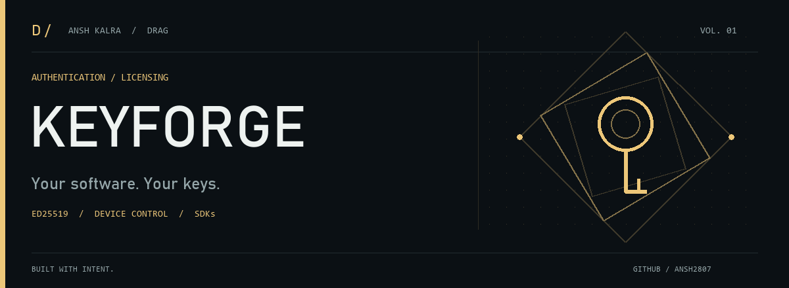

<picture>
  <source media="(prefers-reduced-motion: reduce)" srcset="assets/brand/cover.png">
  
</picture>

# Keyforge

**Software licensing and authentication on your own infrastructure.** Manage licenses, product users, device activations, and signed client responses from one control plane.

[Quick start](#local-setup) · [Deployment](docs/DEPLOYMENT.md) · [SDKs](sdk) · [Security](#security-notes)

<sub>TypeScript · Next.js · PostgreSQL · Prisma · Ed25519</sub>

---

## What it is

Keyforge is a complete control plane for licensing and authenticating your software: a public client API, a customer panel, seller/reseller APIs, an admin dashboard, per-application **Ed25519** signing, and hardened auth (**Argon2id**, TOTP, passkeys). It ships a **KeyAuth-style `/api/1.3` compatibility adapter** so you can migrate incrementally.

## Included

| Area | Capabilities |
|---|---|
| **Licensing** | Plans with JSON entitlements · one-time plaintext license generation · activation, suspension, revocation, expiration, device reset |
| **Client runtime** | Opaque renewable sessions with heartbeat enforcement · Ed25519-signed responses · client nonce echo · build-hash & integrity metadata |
| **Product users** | Registration/login · multiple subscriptions · entitlement-gated resources · TOTP & WebAuthn passkeys |
| **Delivery** | Protected files with plan authorization + SHA-256 verification · runtime variables · remote JSON functions · product chat |
| **Access control** | Hashed deny rules & allowlists for IP, installation, username, and license identity |
| **Sellers & teams** | Scoped seller API keys · credit-limited resellers · team invites with owner / admin / analyst roles |
| **Integrations** | Discord, Telegram & generic notifications · signed webhooks with retry state |
| **Security** | Argon2id passwords · admin TOTP or email OTP · DB-backed login throttling · append-only audit trail |
| **SDKs** | TypeScript, Python, .NET, Java, and C++ — each with signature & nonce verification |

## Requirements

- **Node.js 22+** · **pnpm 11** · **PostgreSQL 14+** · Docker (optional)

## Local setup

```bash
cp .env.example .env
pnpm install
pnpm key:generate        # generate the encryption key
pnpm prisma migrate deploy
pnpm dev
```

Full production notes, hardening, and recovery steps live in **[docs/DEPLOYMENT.md](docs/DEPLOYMENT.md)**.

## Stack

**Next.js** control plane · **Prisma** + **PostgreSQL** schema and migrations · encrypted application signing keys and webhook secrets · Docker image + Compose stack · test suite and deployment guidance included.

## Security notes

- `.env`, `data/`, and `backups/` are git-ignored — no live credentials or database dumps are in this repo. Only `.env.example` (placeholders) and CI/doc examples ship.
- Every successful client response is Ed25519-signed; application signing keys and webhook secrets are stored encrypted at rest.

---

**Built by [Ansh Kalra / DRAG](https://github.com/ansh2807).** Explore the [project collection](https://github.com/ansh2807#selected-work).

<sub>[View the still cover](assets/brand/cover.png) · [Artwork source](https://github.com/ansh2807/ansh2807/blob/main/tools/generate_brand.py)</sub>
